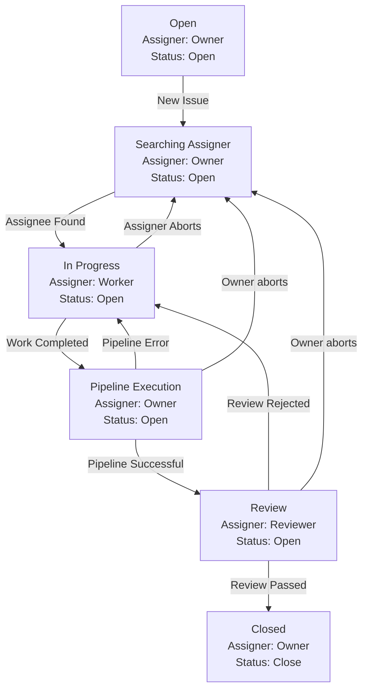

# xia-gpt: Human-AI collaboration for General AI
## Product purpose
* A collaborative workspace where human and AI contributions are equally valued.
* A framework designed to simplify tasks. Adequate context and strong inferential capabilities ensure task success.
* Continuously evolving to decrease human involvement. Reaching 0% signifies the achievement of General AI.
* Highly configurable and compatible with all missions, not limited to just development tasks.

## Quick Start
The quickest way to run xia-gpt is using full cloud context. You just need a navigator and several minutes.

Could be totally free, so even credit card is not needed.

### Quick Start Prerequisite
* A gitlab account with personal token (free-tier compatible). Could either be gitlab SaaS or self-manged instance.
* A GitHub account (free-tier compatible)
* (Recommended) Openai API Key. When an API key is not provided, you could use ChatGPT free version to get all tasks done.

### Quick Start - GitHub Actions
1. Fork repository, generating Gitlab access Token and save it as GitHub secret.

    https://github.com/x-i-a/xia-gpt/assets/128282444/4f416902-7c9d-45c6-ab62-d33f9d931809

2. Company configuration and run the first Hello-World Job with OpenAI API Key

    https://github.com/x-i-a/xia-gpt/assets/128282444/653baa85-89e7-4033-9d48-ded5986ac133

3. Presentation of what is generated during Hello-World Job run

    https://github.com/x-i-a/xia-gpt/assets/128282444/ed8d38d6-2505-4764-9e3c-5da7d0c12155

4. How to run the Hello-World Job without OpenAI API key

    https://github.com/x-i-a/xia-gpt/assets/128282444/88569fe1-5609-4dc4-9067-c45f814262b4

## Product feature
### Highlights
* Much like AutoGPT, they can produce complex outputs from simple instructions using a prompt/answer mechanism.
* A little more than MetaGPT, every prompt/answer is executed by either an AI Agent or a human. The AI Agent operates in a manner similar to humans and offers a range of settings.
* When a task becomes too complex for the current agent, it is escalated to a more capable agent or even a human.
* Integration of validation and review processes enhances the accuracy of each task. When using GitLab to hold work, validation is facilitated through the CI/CD pipeline.
* All conversations are meticulously organized. When using GitLab for storage, they are categorized as Group, Project, Issue, Milestone, Thread, and Note.
* All expenses are accounted for. When stored in GitLab, costs are represented through time tracking.
* Effortlessly configurable to cover all aspects and accomplish every task.

### Basic Function Examples
1. Code Maintenance

2. Image Generation

3. Complex Execution Logic

### Basic Use Guide

## Basic Customization Guide
A clearer understanding of `xia-gpt` design can be beneficial before delving into customization.

### Design Thinking
All activities could be represented by state-to-state flow.
* State is represented as `KnowledgeMap` which consists of a lot of `KnowledgeNode` with their values
* state-to-state must be performed by `Actor`. The `KnowledgeNode` has no ability to change itself
* ONLY two reasons will lead to state-to-state failure: Inadequate context or weak inferential capabilities.
  * `Campaign`, `Mission` and `Task` could help to reducing inferential difficulty while keeping the necessary context
  * `Actor` could escalade to other `Actor` to get more inferential capacities. Human is also a kind of `Actor`
* ONLY two criteria for judging a state-to-state failure: subjective reject or objective reject
  * Subjective reject means the `Actor` refuses the target state. It is controlled by `Review`
  * Objective reject means the target state isn't logically consistent. It is controlled by `Validation` 

### Main customization steps

### Customization File locations
All files are under `templates` directory. Different module will load the file from their related subdirectory.

### Task
`Task` is a reusable unit for a state change. 
It is context irrelevant and has the following sections:
* `format`: gives an example of expected `KnowledgeNode` format
* `guide`, `optimizer`: gives the instruction how the `KnowledgeNode` should be changed. 
* Each section is presented as a block by following jinja2 format.

### Mission
`Mission` is smallest executable unit. It collects necessary context to perform state-to-state change by a group of `Task`

### 
